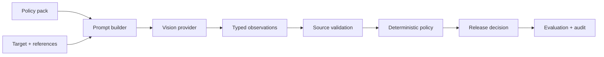

# Visual Release Gate

**Auditable multimodal release decisions for AI-generated creative assets.**

Visual Release Gate reviews a target image against its brief, versioned policy
rules, and approved references. A vision model produces observations; typed
Python policy validates citations and decides whether the asset can `ship`,
must be `reject`ed, needs `human_review`, or is `unsupported` because required
authority is absent.

> **Pre-release status:** the software and fictional benchmark are implemented.
> Labels are provisional until two independent reviewers complete the included
> packets, and live model results remain pending a personal Runware key. The
> hosted-style demo is therefore labelled as a benchmark preview, not a model
> performance claim.

## Why this is different

- **Model observes; code adjudicates.** A schema-shaped model response cannot
  bypass serious-issue, source-authority, or uncertainty invariants.
- **Four decision meanings.** Visual ambiguity is not confused with missing
  licensing, consent, legal approval, or other external authority.
- **Evaluation before claims.** The 24-case fictional benchmark separates eight
  development cases from sixteen held-out cases and includes a two-reviewer
  protocol.
- **Operational evidence.** Ordered batches preserve partial results and record
  attempts, task IDs, latency, usage, and provider-reported cost.

## Architecture



## Quickstart

Requirements: Python 3.11 or 3.12 and [`uv`](https://docs.astral.sh/uv/).

```bash
uv sync --locked
uv run --locked visual-release-gate validate-pack --pack ./sample_pack
uv run --locked pytest
```

Run the safe, precomputed benchmark explorer:

```bash
uv run --locked streamlit run app.py
```

The demo makes no provider calls, accepts no uploads, and reads no secrets.

## Live review

Use a personal Runware key; never reuse an employer- or hiring-process key.

```bash
read -s "RUNWARE_API_KEY?Personal Runware API key: "
export RUNWARE_API_KEY
echo

uv run --locked visual-release-gate review \
  --pack ./sample_pack \
  --output ./.artifacts/reviews.jsonl \
  --budget-usd 5
```

Run both frozen prompt profiles and write a paired evaluation:

```bash
uv run --locked visual-release-gate evaluate \
  --pack ./sample_pack \
  --baseline-output ./.artifacts/baseline.jsonl \
  --improved-output ./.artifacts/improved.jsonl \
  --evaluation-output ./.artifacts/evaluation.json \
  --reviewer-a ./reviewer_a.jsonl \
  --reviewer-b ./reviewer_b.jsonl \
  --budget-usd 5
```

The conservative budget reserve stops before a call when too little budget
remains. Provider-internal retries are disabled; application-owned attempts are
the audit source of truth.

## Policy-pack contract

Each pack contains a `pack.json` manifest pointing to:

- a readable guide and machine-readable rules;
- approved reference-image records;
- structured briefs with explicit copy, action, qualitative, and external
  evidence requirements;
- policy feedback and evaluation labels;
- a public JSON Schema for release decisions.

Pack paths are resolved inside the pack root, image files are decoded before
use, IDs must be unique, and labels must cover every brief. See
[`sample_pack`](sample_pack) for the complete fictional example.

## Evaluation discipline

Two reviewers label cases independently while blinded to model output and one
another. Development labels may inform one improvement. Both prompt profiles
are frozen before held-out labels are revealed. The report includes per-case
results, macro-F1, class precision/recall, serious false approvals, unsafe
approvals, reviewer agreement, calls, runtime, and cost.

No target metric is promised. Regressions and incomplete cases remain visible.
See [`docs/evaluation_protocol.md`](docs/evaluation_protocol.md).

## Security and privacy

- Provider credentials come only from `RUNWARE_API_KEY`.
- Prompts, image data URIs, and credentials are not written to outputs.
- Image text, metadata, briefs, and policy prose are treated as untrusted data.
- The public demo performs no live inference and stores no visitor content.
- External authority is never inferred from pixels.

See [`docs/threat_model.md`](docs/threat_model.md) and [SECURITY.md](SECURITY.md).

## Current limitations

- The included data is synthetic and represents one fictional illustration system.
- Initial labels are author-provisional until independent review is complete.
- The v0.1 provider surface implements Runware only.
- Model revisions can change visual judgments despite fixed configuration.
- A 24-case benchmark demonstrates behavior; it does not establish production accuracy.

## License and attribution

Code is Apache-2.0. The fictional sample pack and original generated images are
released under CC-BY-4.0; generation provenance is documented in
[`sample_pack/PROVENANCE.md`](sample_pack/PROVENANCE.md).
